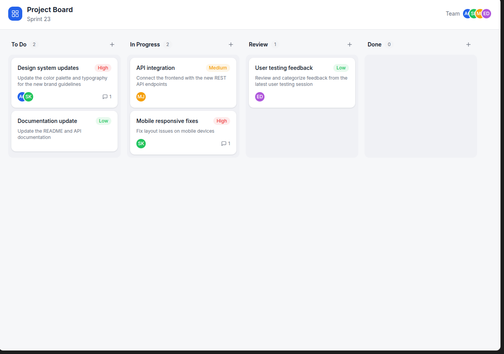
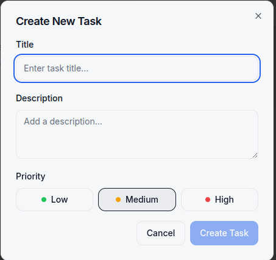
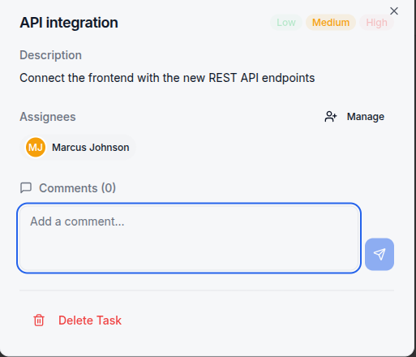

## Benchmark Execution --- Lovable (Team Kanban Board Benchmark)

### 1. Context and Objective

The objective of this second benchmark is to evaluate how **Lovable**, an AI-assisted application builder, interprets and implements a **collaborative kanban board** specification using a single natural language prompt.

Unlike the individual CRUD benchmark, this prompt emphasizes **team-oriented workflows**, visual task progression, and interaction patterns typical of agile project management tools such as Trello or Jira. The benchmark focuses on Lovable’s ability to model **tasks, workflow states, comments, and assignments**, as well as its handling of collaboration-related concepts.

**Team benchmark prompt:**

> _I want a kanban board where team members create cards, move them between columns, add comments, and assign tasks._

---

### 2. First Interaction --- Initial Generation

Lovable was given the team benchmark prompt without any additional clarification or constraints.

After a short generation phase, Lovable produced a functional **kanban board application** with a clean, modern UI. The generated interface displays a single board composed of multiple columns, each containing task cards.

At first glance, the application resembles well-known kanban tools and immediately supports visual task tracking.

---

### 3. Core Kanban Structure

The generated board consists of **four fixed columns**:

- To Do
- In Progress
- Review
- Done

The columns are **predefined and immutable**: users cannot add, remove, or rename columns through the UI. This suggests that Lovable infers a static workflow model rather than a configurable one.

All task cards are displayed on the **main board view**, with no alternative views such as personal dashboards, filters, or swimlanes.

---

### 4. Task Creation and Representation

Lovable provides a modal dialog for creating new tasks.

Each task includes:

- A title
- A description
- A priority level (Low / Medium / High)

Once created, tasks appear as cards inside the selected column, displaying priority badges and assignee avatars.

However, after creation:

- Task **titles and descriptions cannot be edited**
- Task **priority can be modified**

This indicates partial lifecycle support for task entities.

---

### 5. Card Interaction and Workflow Progression

Tasks can be moved between columns **exclusively via drag-and-drop interaction**.

There is no alternative mechanism (such as a status dropdown) to change a task’s state. Tasks can be moved freely between columns, including from `Done` back to earlier stages, indicating no enforced workflow constraints.

---

### 6. Comments and Assignments

Clicking on a task opens a detailed task view.

Lovable supports:

- Adding comments to tasks
- Assigning multiple team members to a single task

Comments appear chronologically and are visually associated with an implicit author. Team members themselves are **predefined** and cannot be managed or authenticated by the user. No login or identity mechanism is exposed in the UI.

---

### 7. Persistence and Collaboration Limitations

Empirical interaction reveals that all data is stored **in memory only**:

- Reloading the page causes a **complete reset**
- Newly created tasks, comments, and assignments are lost

This confirms the absence of persistence and real-time collaboration. Despite the collaborative appearance of the UI, the application behaves as a **single-user, ephemeral prototype**.

---

### 8. Feature Coverage and Missing Capabilities

The following advanced features were explicitly observed to be **absent**:

- ❌ Due dates
- ❌ Labels or tags
- ❌ Search or filtering
- ❌ Sub-tasks or nested cards
- ❌ Real-time multi-user collaboration

As a result, task cards remain flat entities without hierarchy, metadata enrichment, or discoverability mechanisms.

---

### 9. Time and Prompt Count

- **Number of prompts:** 1 initial prompt
- **Follow-up prompts:** None required to obtain a usable result
- **Total time:** On the order of a few minutes from prompt submission to a working application

This indicates a very low interaction cost for obtaining a functional prototype.

---

### 10. Developer Effort and Production Readiness

While the generated application is usable as a prototype, significant additional work would be required to make it production-ready:

- **Persistence:** All data is stored in memory and is lost on page reload
- **Authentication:** No user accounts or identity management
- **Collaboration:** No real-time multi-user synchronization
- **Editability:** Task titles and descriptions cannot be edited after creation
- **Configurability:** Columns are fixed and cannot be customized
- **Advanced features:** No search, filtering, labels, due dates, or sub-tasks
---
Bringing the application to production quality would therefore require:

- Adding a persistent backend
- Implementing authentication and access control
- Extending the task lifecycle model
- Enabling real-time collaboration
- Exposing configuration and management features

As such, Lovable’s output should be considered a **high-fidelity prototype** rather than a deployable system.
---
### 11. Summary and Interpretation

This team benchmark demonstrates that Lovable can quickly generate a **visually convincing kanban board** that supports core interactions such as task creation, drag-and-drop workflow progression, commenting, and assignment.

However, the generated model prioritizes **surface-level usability** over depth of collaboration. Key team-oriented features—such as persistence, authentication, configurability, and real-time synchronization—are absent. Tasks exist as transient UI objects rather than durable, fully managed entities.

This reinforces a broader observation from both benchmarks: Lovable excels at producing **immediate, intuitive prototypes**, but offers limited control over deeper modeling concerns, particularly in collaborative and stateful domains.
