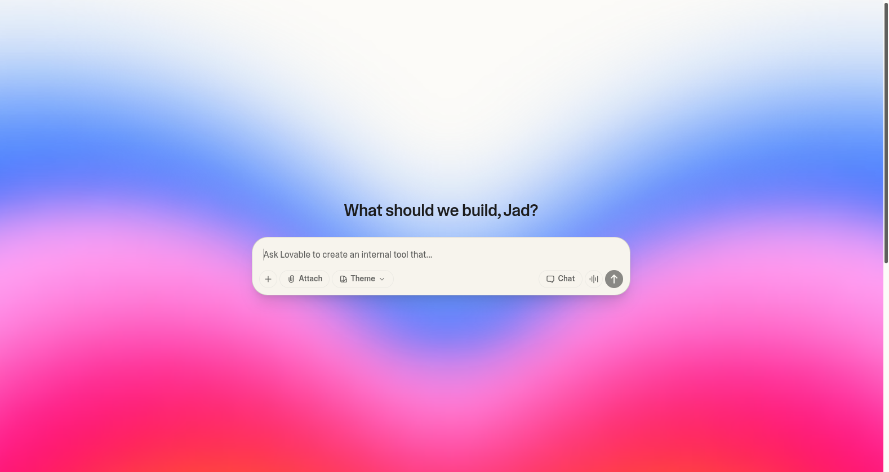
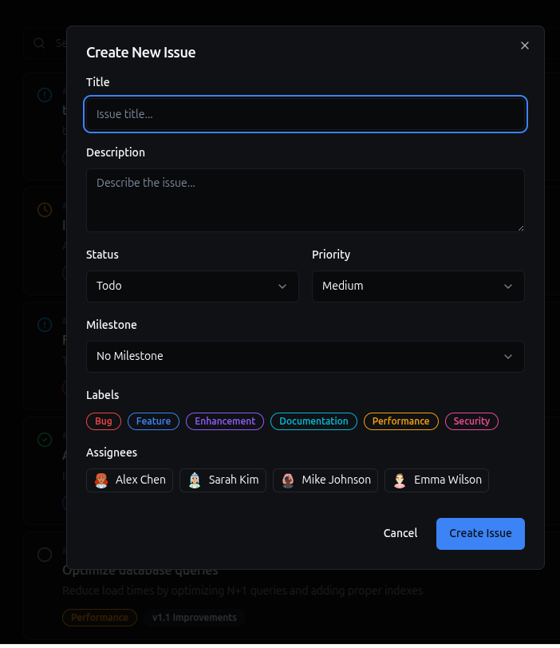
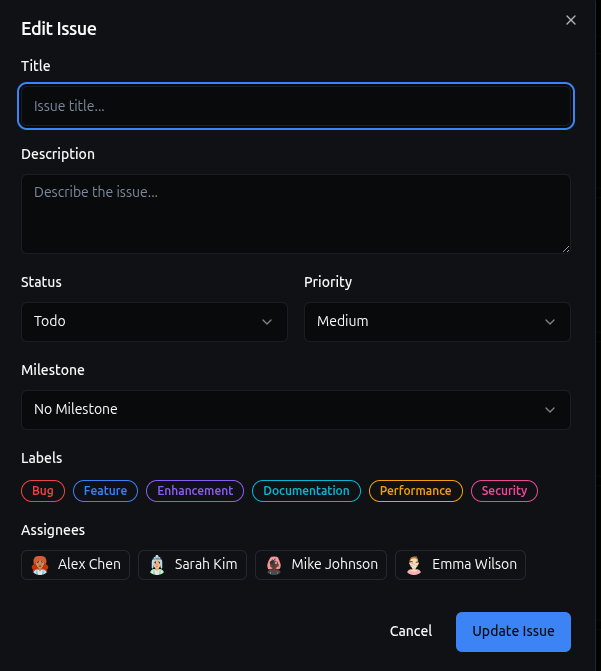
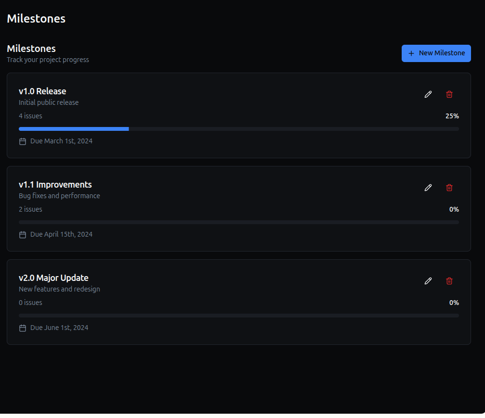
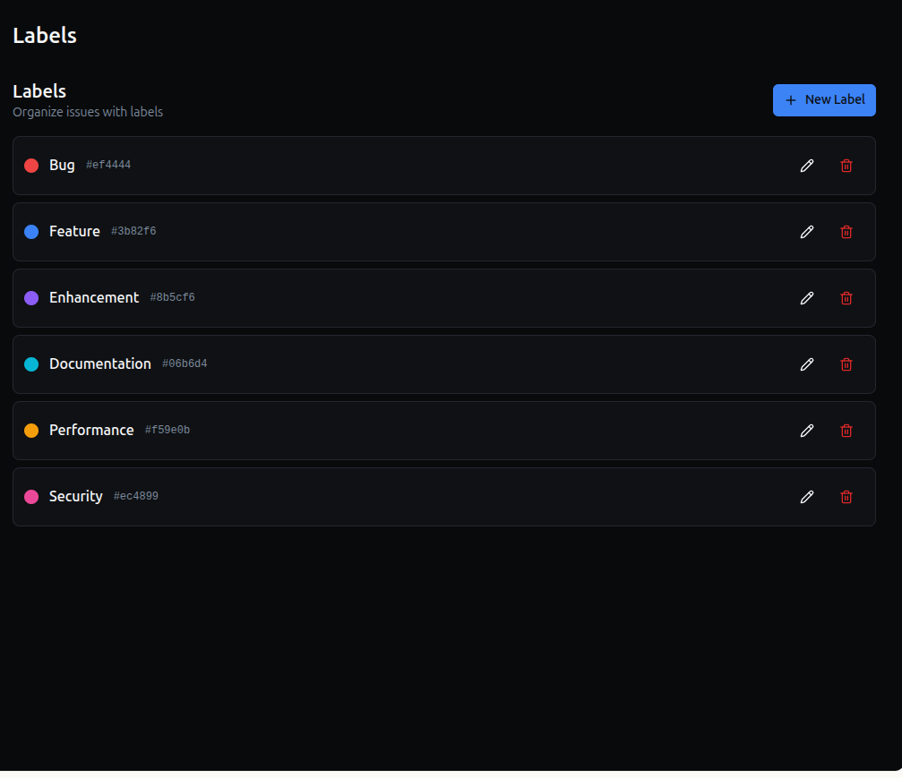
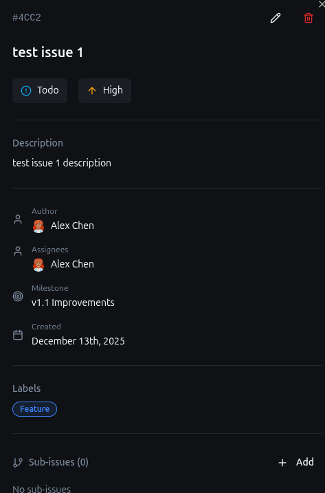
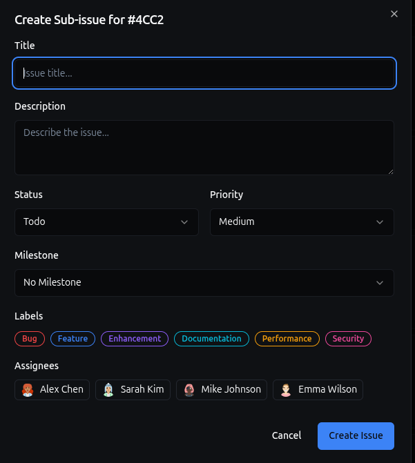
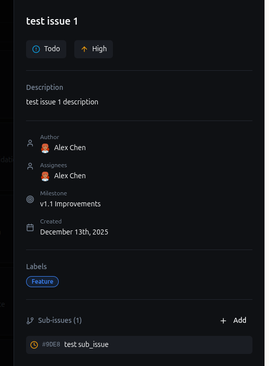

# 🤖 Lovable Analysis

## 1. Lovable Overview and Context

### 1.1 Brief Description

- **Tool Name:** Lovable
- **Primary Purpose:**  
  Lovable is an AI-assisted application builder designed to generate complete web applications from natural language prompts. Its primary goal is to enable rapid prototyping of CRUD-style applications without requiring explicit code writing or manual data modeling.
- **Integration / Environment:**  
  Lovable is a web-based tool accessed through a browser. Users interact with it via natural language prompts and a visual application canvas that displays the generated UI and behavior.
  

---

### 1.2 Target Users

Lovable primarily targets:

- Non-developers or low-code users wanting to build applications quickly
- Developers seeking rapid prototyping or idea validation
- Students experimenting with AI-assisted development
- Early-stage startup teams exploring product concepts

The tool abstracts away most architectural and modeling decisions, making it accessible to users without formal software engineering background.

### 1.3 Requirements and Availability

- **Installation:**  
  No local installation is required. Lovable is accessed directly through a web browser.
- **Availability:**  
  A free tier is available, allowing users to experiment with application generation and iterative prompting.  
  At the time of evaluation, the free tier provides a limited number of **daily credits** (5 credits), which reset automatically at **midnight UTC**. Each AI interaction consumes one or more credits, while the exact token usage is abstracted away from the user.
- **Evaluation Context:**  
  The tool was evaluated using its free web interface, without additional configuration or paid features.

### 1.4 Summary

This report analyzes Lovable as an AI coding assistant through UI inspection, functional analysis, conceptual modeling, and empirical pseudo-benchmarks. Special attention is given to how Lovable infers data models and relationships implicitly from natural language prompts.

---

## 2. User Interface (UI) Analysis

Users interact with Lovable primarily through:

- Natural language prompts
- A visual application canvas displaying generated. Manuallly editing the UI components on the canvas is also possible.
- Iterative refinement via follow-up prompts

There is no exposed command-line interface or code editor.

### 2.1 Interaction Modalities

Users interact with Lovable’s AI primarily through **natural language prompts** entered in a dedicated input interface. The interaction model is conversational but remains largely one-directional: the user issues instructions, and the AI responds by generating or modifying an application.

- **Chat/Text:**  
  Users describe the desired application and subsequent modifications using free-form natural language prompts.

- **In-line / Contextual:**  
  Lovable does not provide inline or contextual suggestions within code, as no source code editor is exposed to the user.

- **Visual / Canvas:**  
  The AI’s output is presented through a **visual application canvas**, where the generated application can be inspected and interacted with. The canvas serves as indirect feedback on the AI’s interpretation of the prompt rather than a direct interaction mechanism.

- **Command Line (CLI):**  
  Lovable does not expose any command-line interface.

  Interaction is iterative and prompt-driven. Follow-up prompts are used to refine or extend the generated application, but users cannot directly manipulate the underlying model or schema.

### 2.2 UI Components and Layout

Lovable’s user interface is organized around a clear separation between **AI interaction controls** and **AI-generated output**, although both are visually integrated within the same web interface.

- **Dedicated AI Pane:**  
  Lovable provides a dedicated area for entering natural language prompts. This pane is used to issue initial instructions and follow-up modifications to the application. The AI pane does not expose configuration options, model parameters, or schema controls; it strictly accepts high-level textual instructions.

- **Code / Design Synchronization:**  
  Lovable exposes read-only source code to the user. Indeed, generated artifacts are presented through a **visual application canvas** that displays the resulting UI (lists, forms, navigation, and modals). Changes requested via prompts are reflected directly in the canvas, creating an implicit synchronization between the user’s textual instructions and the visual representation of the application.

- **Feedback Mechanisms:**  
  Feedback is primarily visual and implicit. When a prompt is processed, the user observes changes in the generated application (new views, new UI elements, or modified behavior). There are no explicit compilation logs, error traces, or schema diff views. Progress indicators and credit counters provide minimal operational feedback, while semantic correctness must be inferred by inspecting the resulting UI.

- **Screenshots:**  
  Screenshots illustrating the generated application views (issues list, milestone management, label management, and sub-issue handling) are provided in the benchmark section and collected separately as raw material for presentation slides.

### 2.3 User Experience (UX) Critique

- **Clarity / Intuitiveness:**  
  Lovable is easy to approach for first-time users. The interaction model is simple: users describe what they want in natural language and inspect the resulting application visually. The generated UI follows familiar patterns inspired by tools such as GitHub or Linear, which reduces the learning curve. However, the lack of explicit feedback about modeling decisions (e.g., how entities and relationships are inferred) can make it difficult for users to understand _why_ certain structures appear.

- **Latency:**  
  AI response time is generally acceptable for interactive use. Application generation and modifications occur within a short delay, enabling an iterative workflow. While the generation phase introduces a noticeable wait, it does not significantly disrupt the user experience for exploratory or prototyping scenarios.

- **Integration Quality:**  
  Lovable operates primarily as a standalone web application. However, optional GitHub integration allows generated code to be synchronized with external repositories, enabling partial integration into traditional development workflows without exposing modeling controls inside the tool itself.

---

## 3. Features Model (Functional Analysis)

This section describes the main functional features provided by **Lovable as a tool**, independently of any specific application generated during the benchmarks.

### 3.1 AI-Driven Application Generation

Lovable allows users to generate complete web applications from natural language prompts. Users describe desired functionality at a high level, and the tool infers application structure, UI components, and behavior without requiring explicit coding or schema definition.

This feature enables rapid prototyping and lowers the entry barrier for users without strong software development backgrounds.

---

### 3.2 Implicit Data Modeling

Lovable automatically infers data entities, attributes, and relationships from user prompts. The data model is not explicitly declared by the user and is not directly editable. All modeling decisions are handled internally by the tool.

This implicit modeling approach prioritizes convenience and speed, but limits user control over domain structure and constraints.

---

### 3.3 Automatic CRUD and UI Generation

For inferred entities, Lovable generates:

- CRUD operations
- Lists, forms, and detail views
- Navigation elements

The generated UI follows consistent design patterns and is immediately usable without additional configuration.

---

### 3.4 Iterative Prompt-Based Refinement

Lovable supports iterative development through follow-up prompts. Users can request changes, additions, or refinements using natural language, and the tool updates the application accordingly.

There is no explicit versioning or diff visualization; changes are reflected directly in the generated application.

---

### 3.5 In-Memory Execution and Optional Persistence

By default, applications generated by Lovable use in-memory storage, enabling fast experimentation without setup. Persistent storage can be enabled through Lovable Cloud or external integrations.

Storage configuration remains abstracted away from the user.

---

### 3.6 GitHub Integration and Code Synchronization

Lovable provides optional integration with GitHub, allowing generated application code to be exported and synchronized with an external repository.

This feature supports:

- Code backup and version history
- Collaboration through standard GitHub workflows
- Two-way synchronization between Lovable and the default branch
- Local development and external deployment

Despite exposing the generated code, this integration does not expose Lovable’s internal data model or modeling logic.

---

### 3.7 Standalone Web-Based Environment

Lovable operates as a standalone web application. Users do not need to install local tooling, configure environments, or manage dependencies.

This design choice improves accessibility but limits tight integration with traditional IDE-based development workflows.

---

### 3.8 Resource Abstraction and Credit-Based Usage

Lovable abstracts resource consumption behind a credit-based usage model. Users interact with the AI without visibility into underlying token usage, model selection, or execution cost.

This abstraction simplifies usage but reduces transparency regarding resource management.

---

## 4. Conceptual Model

The conceptual model of Lovable can be found in the [Lovable.tml](Lovable.tml) file.

---

## 5. Pseudo Benchmarks and Criteria

This section details the empirical assessment of the TOOL tool using two pseudo benchmarks. Scientific benchmarks use strict protocols and objective criteria; here, "pseudo" benchmarks are informal yet practical.

### 5.1 Milestones Pseudo Benchmark

## Benchmark Execution --- Lovable (Course CRUD Benchmark)

### 1\. Context and Objective

The objective of this benchmark is to evaluate how **Lovable**, an AI-assisted application builder, interprets and implements a small but structured CRUD specification using a single natural language prompt.\
The benchmark focuses not only on UI generation, but also on **implicit data modeling**, **relationships**, and **concept completeness**, which are core topics of the Coding Without Coding course.

The benchmark prompt used is intentionally simple and inspired by common software development tools such as GitHub or Linear.

**Benchmark prompt:**

> _I want a CRUD application with milestones, (sub)issues, labels, author, and assignees._

---

### 2\. First Interaction --- Initial Generation

Lovable was given the benchmark prompt without any additional clarification or constraints.

After a short generation phase, Lovable produced a fully functional **issue tracking application** with a modern, Linear-inspired dark UI. The generated application includes sidebar navigation, multiple views, and interactive modals.

At this stage, Lovable already supports:

- Creating issues

- editing, and deleting

- Assigning status and priority

- Associating issues with milestones

- Adding labels with colors

- Displaying authors and assignees via avatars

The tool makes several **implicit assumptions**, notably that users already exist and that authentication is out of scope.

---

### 3\. Milestones and Labels Management

Lovable generates dedicated views for both **milestones** and **labels**, each with CRUD capabilities.

Milestones are not just static containers: Lovable automatically computes a completion percentage based on issue status. This indicates that the tool internally reasons about relationships between issues and milestones, even though this model is not explicitly exposed to the user.

Labels are treated as reusable entities and can be attached to issues in a many-to-many fashion.

---

### 4\. First Evaluation Against the Benchmark

After the first generation, most benchmark requirements are clearly satisfied:

- Issues ✔

- Milestones ✔

- Labels ✔

- Author ✔ (implicit)

- Assignees ✔ (multiple)

However, **sub-issues** are only mentioned by the tool and not visibly implemented in the UI. Issues appear as **flat entities**, without any parent--child relationship.

At this point, sub-issues are **claimed but not observable**, which motivates a controlled follow-up.

---

### 5\. Second Interaction --- Requesting Sub-Issues Explicitly

A second prompt was issued to Lovable:

> _Add support for sub-issues, where an issue can have child issues._

After this interaction, Lovable modifies the application by introducing a **Sub-issues section** inside the issue detail view.

Lovable now allows the creation of a sub-issue linked to a parent issue.

This confirms that Lovable is capable of modeling a **reflexive relationship** (Issue → Issue), at least at a minimal level.

---

### 6\. Observed Limitations of Sub-Issues

While sub-issues can be created and are displayed under their parent issue the following limitations were observed empirically during interaction with the generated UI:

- Sub-issues cannot be clicked to open a detailed view

- Sub-issues cannot be edited or deleted

- Sub-issues cannot themselves have sub-issues (no recursive hierarchy)

- Sub-issues do not appear in global issue lists

- Sub-issues cannot be searched or filtered

As a result, sub-issues behave as **second-class entities** rather than full issues.

Structurally, the model implemented by Lovable corresponds to:

`Issue
 └── SubIssue   (depth = 1 only)`

rather than a fully recursive issue hierarchy.

---

### 7\. Storage and Model Visibility

Lovable explicitly states that all data is stored **in memory** using Zustand. No persistence is enabled by default.

This has two important implications:

- The underlying data model is **hidden** from the user

- Users cannot directly inspect or modify relationships, cardinalities, or constraints

All modeling decisions are inferred and controlled by the tool.

---

### 8\. Summary and Interpretation

This benchmark shows that Lovable excels at rapidly generating a **convincing and usable CRUD interface** from a single natural language prompt. Core concepts such as issues, milestones, labels, and assignments are handled well with minimal user effort.

However, more advanced modeling concepts---particularly **recursive relationships** and **full lifecycle management of sub-entities**---are only partially supported. Sub-issues exist structurally but lack the completeness and autonomy of regular issues.

This highlights a key characteristic of AI coding assistants: they prioritize **speed and usability** over **explicit modeling control**, which can become a limitation when domain complexity increases.

### 5.2 Group-Selected Benchmark

> **Prompt/Scenario Description:**
> Choose a _distinct_ benchmark scenario for your group (e.g., "Create a cinema web application to display films and sell tickets"). The scenario should be relevant to course topics and allow meaningful comparison between tools.
>
> - **Result Description:** Clearly describe what the tool produced for this prompt (code, design, config files, etc.). List generated artifacts if possible.
> - **Time and Prompt Count:** Record the total time from initial prompt to final output, and the number of prompts required to reach a satisfactory result.
> - **Developer Effort:** Estimate the additional work needed to make the output production-ready (e.g., fixing errors, adding missing logic, integration).

---

## 6. Conclusion and Future Work

> Summarize key findings.
